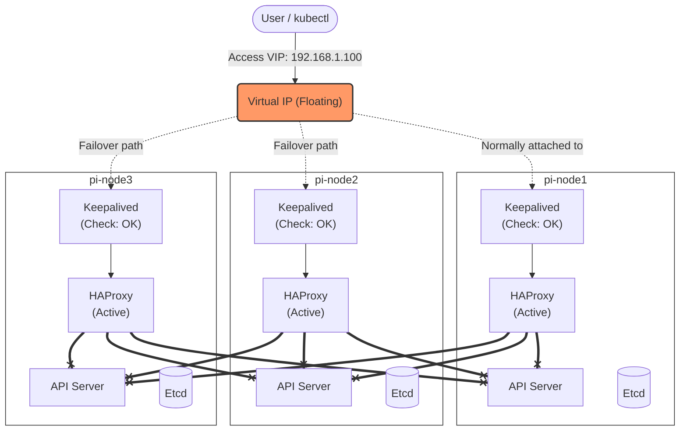

# Ansible Directory - Phase 1: OS設定 & Kubeadm構築

このディレクトリには、Raspberry Piクラスターの物理層（OS設定）から Kubernetes クラスターの初期構築（Kubeadm）までを担当する Ansible Playbook が含まれています。

本プロジェクトの **基盤（Foundation）** を構築するフェーズです。

## 📂 ディレクトリ構造

```text
ansible/
├── inventory/
│   ├── inventory.ini          # 🟢 本番環境 (Raspberry Pi) 用インベントリ
│   └── inventory_vagrant.ini  # 🔵 テスト環境 (Vagrant) 用インベントリ
├── roles/
│   ├── common/                # 共通設定 (Swap無効化, cgroup設定, 必須pkg)
│   ├── container-runtime/     # コンテナランタイム (containerd) の導入
│   └── kubeadm/               # クラスタ構築 (init / join)
├── scripts/                   # 構築ロジック (ShellScript)
├── site.yml                   # メイン Playbook
├── fetch-kubeconfig.yml       # admin.conf をローカルに取得する Playbook
├── reset.yml                  # クラスタ初期化・削除用
├── upgrade.yml                # バージョンアップ用
└── verify.yml                 # 構築後の動作検証用

```

## 🏗 アーキテクチャ概要

本クラスタは、**ハイパーコンバージド構成** かつ **完全な高可用性 (HA)** を備えています。

### 1. ノード構成 (Node Topology)

3台の Raspberry Pi 全てにおいて、**Master Role (管理機能)** と **Worker Role (計算リソース)** が同居しています。

* **Master Role (青):** クラスタの制御、API提供、データ保存 (Etcd)
* **Worker Role (橙):** ユーザーアプリケーションの実行

これにより、どのノードがダウンしても管理機能・アプリ実行の両方が維持されます。



### 2. 高可用性とトラフィックフロー (HA & Traffic Flow)

**Keepalived (VRRP)** と **HAProxy** を全ノードに配置することで、単一障害点 (SPOF) を排除しています。

* **VIP (仮想IP):** ユーザーは常に VIP (`192.168.1.100`) にアクセスします。
* **Failover:** 現在のマスターがダウンすると、VIPは即座に別ノードへ移動します。
* **Load Balancing:** HAProxy は自分自身を含む「生きている全ノード」の API Server にリクエストを分散します。



## 🚀 使い方

プロジェクトルートの `Makefile` を使用することで、簡単に実行できます。

### Step 1: インベントリの編集

ご自身の環境に合わせて IP アドレス等を設定してください。

```bash
vi ansible/inventory/inventory.ini
```

### Step 2: 構築の実行 (Provisioning)

Ansible を実行し、OS 設定から K3s/K8s の起動までを行います。

```bash
make ansible-setup
```

### Step 3: 接続設定の取得 (Fetch Kubeconfig)

クラスターの管理者権限ファイル (`admin.conf`) を取得し、手元の PC から `kubectl` できるようにします。

```bash
make fetch-kubeconfig
```

### Step 4: 動作検証 (Verify)

全ノードが Ready か、HA 構成が機能しているかをテストします。

```bash
ansible-playbook -i inventory/inventory.ini verify.yml
```